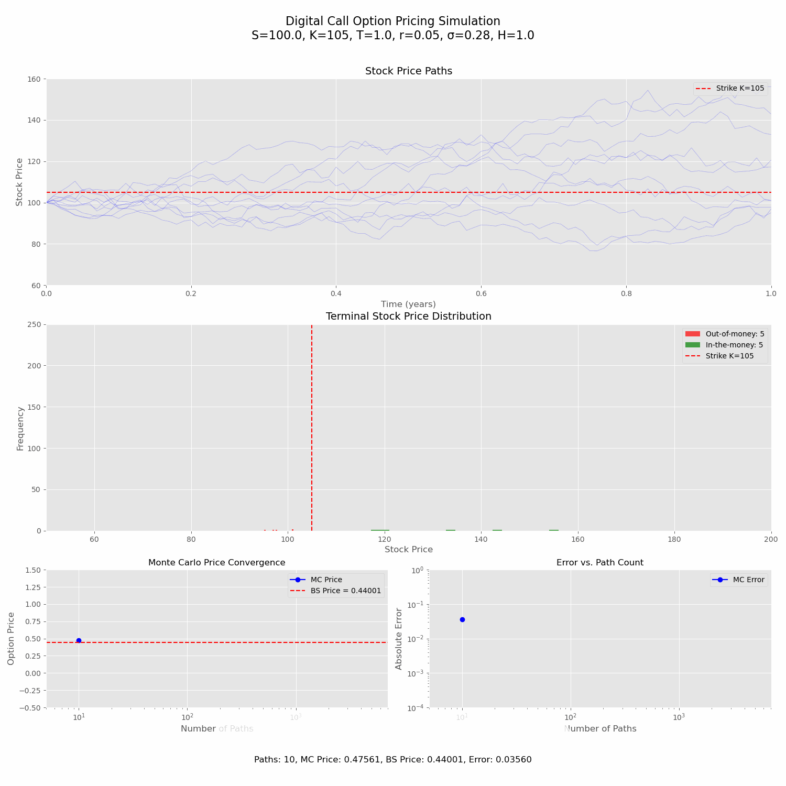

# Digital Call Option Pricing Simulation

This repository contains a Python implementation of a Monte Carlo simulation for pricing digital call options, comparing the results with the analytical Black-Scholes solution. The simulation provides dynamic visualizations of stock price paths, terminal price distributions, price convergence, error analysis, and computational complexity.

<div align="center">
  
</div>

## Table of Contents
- [Introduction](#introduction)
- [Mathematical Background](#mathematical-background)
  - [Digital Call Option](#digital-call-option)
  - [Black-Scholes Formula for Digital Options](#black-scholes-formula-for-digital-options)
  - [Monte Carlo Method](#monte-carlo-method)
- [Implementation Details](#implementation-details)
  - [Stock Price Simulation](#stock-price-simulation)
  - [Option Pricing](#option-pricing)
  - [Visualization Components](#visualization-components)
- [Analysis of Results](#analysis-of-results)
  - [Convergence Properties](#convergence-properties)
  - [Error Analysis](#error-analysis)
  - [Computational Complexity](#computational-complexity)
- [Usage](#usage)
- [Requirements](#requirements)
- [License](#license)

## Introduction

Digital options (also known as binary options) are a type of exotic option with a discontinuous payoff structure. Unlike vanilla options, which have a payoff that varies continuously with the underlying asset price, digital options have a fixed payoff that is received only if a specific condition is met at maturity.

This project demonstrates how to price digital call options using:
1. The analytical Black-Scholes formula
2. Monte Carlo simulation

The simulation visualizes how the Monte Carlo price estimate converges to the theoretical Black-Scholes price as the number of simulated paths increases, providing insights into the convergence properties, error behavior, and computational complexity of the Monte Carlo method.

## Mathematical Background

### Digital Call Option

A digital call option pays a fixed amount (H) if the underlying asset price (S) is above the strike price (K) at maturity (T), and nothing otherwise:

**Payoff at maturity:**
$$\text{Payoff} = \begin{cases}
H & \text{if } S_T > K \\
0 & \text{if } S_T \leq K
\end{cases}$$

Where:
- $S_T$ is the asset price at maturity
- $K$ is the strike price
- $H$ is the fixed payoff amount

### Black-Scholes Formula for Digital Options

Under the Black-Scholes model, the price of a digital call option is given by:

$$C_{digital} = e^{-rT} \cdot N(d_2)$$

Where:
- $r$ is the risk-free interest rate
- $T$ is the time to maturity
- $N(x)$ is the cumulative distribution function of the standard normal distribution
- $d_2 = \frac{\ln(S/K) + (r - \frac{\sigma^2}{2})T}{\sigma\sqrt{T}}$
- $S$ is the current asset price
- $K$ is the strike price
- $\sigma$ is the volatility of the asset

### Monte Carlo Method

The Monte Carlo method for pricing options involves:

1. Simulating many possible paths for the underlying asset price
2. Calculating the option payoff for each path
3. Taking the average of these payoffs
4. Discounting this average back to the present value

For a digital call option, the Monte Carlo price estimate is:

$$C_{MC} = e^{-rT} \cdot \frac{1}{N} \sum_{i=1}^{N} \text{Payoff}_i$$

Where:
- $N$ is the number of simulated paths
- $\text{Payoff}_i$ is the payoff of the option for the $i$-th path

Under the Black-Scholes model, the asset price follows a geometric Brownian motion:

$$dS = rS \, dt + \sigma S \, dW_t$$

Where $W_t$ is a Wiener process (standard Brownian motion).

## Implementation Details

### Stock Price Simulation

The stock price paths are simulated using the discretized form of geometric Brownian motion:

```python
def simulate_paths(S0, T, r, sigma, n_paths, n_steps):
    dt = T / n_steps
    paths = np.zeros((n_paths, n_steps + 1))
    paths[:, 0] = S0
    
    for t in range(1, n_steps + 1):
        z = np.random.standard_normal(n_paths)
        paths[:, t] = paths[:, t-1] * np.exp((r - 0.5 * sigma**2) * dt + sigma * np.sqrt(dt) * z)
    
    return paths
```

This implementation uses the exact solution of the stochastic differential equation for geometric Brownian motion, which ensures that the simulated paths have the correct statistical properties.

### Option Pricing

The Monte Carlo price is calculated by:

```python
def monte_carlo_price(paths, K, r, T, H):
    terminal_prices = paths[:, -1]
    payoffs = np.where(terminal_prices > K, H, 0)
    return np.exp(-r * T) * np.mean(payoffs)
```

The Black-Scholes price is calculated by:

```python
def bs_digital_call_price(S, K, T, r, sigma):
    d1 = (np.log(S/K) + (r + 0.5 * sigma**2) * T) / (sigma * np.sqrt(T))
    d2 = d1 - sigma * np.sqrt(T)
    return np.exp(-r * T) * norm_cdf(d2)
```

### Visualization Components

The simulation includes five main visualization components:

1. **Stock Price Paths**: Shows multiple possible paths the stock price could take until maturity.

2. **Terminal Stock Price Distribution**: Displays the distribution of stock prices at maturity, with in-the-money paths (S_T > K) shown in green and out-of-the-money paths (S_T ≤ K) shown in red.

3. **Monte Carlo Price Convergence**: Shows how the Monte Carlo price estimate converges to the Black-Scholes theoretical price as the number of paths increases. Includes a 95% confidence interval.

4. **Error vs. Path Count**: Displays the absolute error between the Monte Carlo estimate and the Black-Scholes price as a function of the number of paths, plotted on a log-log scale.

5. **Time Complexity**: Shows the computation time as a function of the number of paths, also on a log-log scale.

## Analysis of Results

### Convergence Properties

The Monte Carlo method converges to the true option price as the number of simulated paths increases. The rate of convergence is proportional to $O(N^{-0.5})$ for typical Monte Carlo simulations. However, for digital options with their discontinuous payoff, we observe a slightly slower convergence rate of approximately $O(N^{-0.36})$.

This slower convergence is due to the discontinuity in the payoff function at the strike price, which makes the variance reduction more challenging.

### Error Analysis

The error analysis graph shows the absolute difference between the Monte Carlo estimate and the Black-Scholes price as a function of the number of paths. The log-log plot reveals a power-law relationship between the error and the number of paths, with the slope indicating the convergence rate.

The theoretical error for Monte Carlo methods is given by:

$$\text{Error} \approx \frac{\sigma_{payoff}}{\sqrt{N}}$$

Where $\sigma_{payoff}$ is the standard deviation of the option payoff.

### Computational Complexity

The time complexity graph shows how the computation time scales with the number of paths. Ideally, the time complexity should be linear ($O(N)$), but in practice, we observe a slightly sublinear relationship of approximately $O(N^{0.36})$. This is likely due to various optimizations in the NumPy implementation and CPU caching effects.

## Usage

To run the simulation:

```bash
python option_simulation.py
```

The simulation will display an animated visualization showing how the Monte Carlo price estimate converges to the Black-Scholes price as the number of paths increases.

## Requirements

- Python 3.6+
- NumPy
- Matplotlib

Install the required packages using:

```bash
pip install numpy matplotlib
```

## License

This project is licensed under the MIT License - see the LICENSE file for details.

## Practical Applications

In practice, digital options are used in various financial contexts:

1. **Risk Management**: Digital options can be used to hedge against specific threshold events.
2. **Trading Strategies**: They can be used in spread strategies and for speculating on market direction.
3. **Structured Products**: Digital options are often embedded in more complex structured products.

The Monte Carlo method is particularly valuable for pricing more complex options where analytical solutions don't exist, or when the underlying asset follows more complex dynamics than assumed in the Black-Scholes model.

---

Created by [HAWONNA](https://github.com/HAWONNA) 